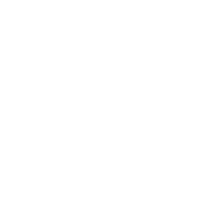

<div align="center">
  
  
  # [Star Wars 3D Models & Blueprints: Front End Web App using Gatsby.js and Styled Components](https://starwars-spaceships.netlify.app/)
  
  [](https://app.netlify.com/sites/starwars-spaceships/deploys)
  
  [](https://www.codacy.com/gh/JacobGrisham/Gatsby.js-and-Styled-Components/dashboard?utm_source=github.com&amp;utm_medium=referral&amp;utm_content=JacobGrisham/Gatsby.js-and-Styled-Components&amp;utm_campaign=Badge_Grade)
  
</div>

## 🚀 Getting Started
To run this project locally:
- In your terminal, navigate to the root project directory and run the following commands
- To install the dependencies
```
npm install
```
- To start the website
```
npm run dev
```

## 📣 Attribution
- Star Wars created by Lucasfilm Ltd.
- Starship information from [Star Wars API](https://swapi.dev/)
- Aurebesh Font from [Online Web Fonts](https://www.onlinewebfonts.com/download/ad4908c2b00349b5ccefeb6be87ce49c)
- Sound Effects from [Find Sounds](https://www.findsounds.com/ISAPI/search.dll?start=21&keywords=Star%20Wars&seed=40)
- Starship 3D Models created by YamahaDrummer2017 from [SketchFab](https://sketchfab.com/yamahadrummer2017)
- Favicon Death Star created by Henning Gross from [the Noun Project](https://thenounproject.com/search/?q=death+star&i=1007126)
- 404 R2D2 created by Simon Child from [the Noun Project](https://thenounproject.com/search/?q=droid+star+wars&i=367715)
- Tie Fighter created by Linker from [the Noun Project](https://thenounproject.com/search/?q=tie+fighter&i=2202280)
- Star Destroyer ceated by Henning Gross from [the Noun Project](https://thenounproject.com/search/?q=star+destroyer&i=994294)
- Navigation Death Star created by Ben David from [the Noun Project](https://thenounproject.com/search/?q=death+star&i=1571954)
- Volume Button created by Agarunov Oktay-Abraham from [the Noun Project](https://thenounproject.com/search/?q=volume&i=576880)
- Star Wars Hyperspace Copyright (c) 2021 by [yonatan](https://codepen.io/ybensira/pen/byYNBZ)
- Remaining Star Wars Icons and Logos from Various Sources

## 🔒 License
Copyright Notice and Statement: currently not offering any license. Permission only to view and download.
